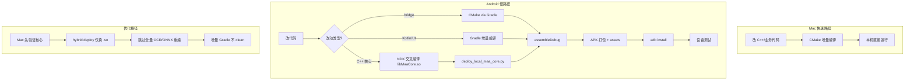

# Mac 与 Android 构建效率差异分析及优化建议

> **文档用途**：供开发侧 Agent 评估当前跨平台构建流程，识别瓶颈并制定优化方案。  
> **适用项目**：核心代码共享、Mac 原生版 + Android APK 封装版（参考：MaaAssistantArknights + MAA-Meow）。  
> **文档日期**：2026-06-21

---

## 1. 背景与问题描述

同一工具存在两个版本：

- **Mac 版**：在本机直接编译运行，改完代码后可在秒～分钟级完成构建并测试。
- **Android 版**：在 Mac 上交叉编译、打包 APK，安装到手机/模拟器后测试；全流程常需 **30 分钟～1 小时**，且容易遇到环境、依赖、ABI 匹配等问题。

核心 C++ 业务逻辑大致相同，Android 版额外包含 JNI bridge、Android 专有 API、预编译 `.so` 与大量 assets 的部署逻辑。

**期望目标**：评估能否将 Android 日常迭代耗时从「接近 1 小时」压缩到「数分钟级」，并明确哪些环节无法与 Mac 版对等。

---

## 2. 核心结论（给评估方的 TL;DR）

| 结论 | 说明 |
|------|------|
| **完全对等不可行** | Android 构建链路天然比 Mac 原生构建多 4～6 个重量级环节，无法做到「改完立刻跑」的同等体验。 |
| **大幅优化可行** | 通过分层验证、增量构建、仅替换 `.so`、hybrid deploy 等手段，可将日常迭代压缩到 **1～15 分钟**（视改动范围而定）。 |
| **最大瓶颈通常在 C++ 核心交叉编译** | 若每次改动都触发全量 NDK 重编 MAA Core + 全量 APK + 大 assets 打包，1 小时属于正常现象。 |
| **优化方向是「减少全量构建频率」** | 而非追求让 Gradle/APK 打包本身变得和 `ninja` 一样快。 |

---

## 3. 根因分析

### 3.1 构建链路对比

| 环节 | Mac 版 | Android APK |
|------|--------|-------------|
| 编译目标 | 本机架构（arm64 Mac） | 交叉编译至 `arm64-v8a` / `x86_64` |
| 工具链 | Clang + CMake，增量编译成熟 | JDK + Gradle + AGP + NDK + CMake |
| 输出物 | 可执行文件 / dylib | APK（Kotlin/Java + 资源 + 多个 .so + assets） |
| 运行方式 | 本地直接执行 | 打包 → adb 安装 → 设备启动 |
| 典型增量耗时 | 秒～分钟 | 分钟～数十分钟 |

### 3.2 Android 构建「重」的具体环节

一次 `assembleDebug` 通常包含：

1. Gradle 配置与任务图计算
2. Kotlin/Java 编译
3. AAPT2 资源处理
4. CMake/NDK 编译 native 代码（如 bridge 层）
5. 合并/压缩大量 assets（MAA 资源可达数千文件）
6. DEX 合并、APK 对齐、签名

### 3.3 移植层带来的额外复杂度

「核心代码差不多」通常仅指 C++ 业务逻辑。Android 侧还有：

- JNI / bridge 层（如 `bridge.cpp`）
- Android 专有 API（`log`、`mediandk`、`jnigraphics`、`EGL` 等）
- 预编译 `.so` 与资源部署脚本（`setup_maa_core.py`、`deploy_local_maa_core.py`）
- 官方 OCR/ONNX 栈与自定义 `libMaaCore.so` 的 hybrid 混部逻辑
- ABI、JNA/JNI 接口、资源版本一致性校验

### 3.4 耗时分布参考（需实测验证）

| 场景 | 合理预期 |
|------|---------|
| 只改 Kotlin/Compose，环境就绪，增量构建 | 1～5 分钟 |
| 改 native bridge + 增量 Gradle | 5～15 分钟 |
| 重编 `libMaaCore.so` + deploy + APK | 15～40 分钟 |
| 首次搭环境 / clean build / 下载全量依赖 | 30 分钟～1 小时+ |

> 注：项目内 `local_build_apk.sh` 注释写明环境就绪后单次 rebuild 约 **~10 分钟**；若感知接近 1 小时，需排查是否包含 MAA Core 交叉编译、首次下载、或频繁 clean。

---

## 4. 优化策略（按优先级）

### 策略 A：分层验证（最高优先级）

**原则**：能在 Mac 上验证的逻辑，不要放到 Android 全量构建里才发现问题。

| 改动类型 | 建议验证顺序 |
|---------|-------------|
| C++ 核心逻辑 | 先在 Mac 构建验证 → 再交叉编译 Android |
| Android bridge/JNI | Mac 侧能测的先测 → 再测 Android |
| Kotlin/UI/业务层 | 直接 Android 增量构建 |
| 资源/模型文件 | 避免每次全量打包，按需 deploy |

### 策略 B：避免每次打完整 APK

适用于带大量 native 库的项目：

1. **仅替换 `.so`（调试阶段）**
   - 若只改了 `libMaaCore.so`，可通过 `adb push` 热替换，跳过完整 APK 构建。
   - 需确认 app 加载路径与权限（部分场景需 root 或可写目录）。

2. **Hybrid deploy（项目已具备）**
   - 使用 `deploy_local_maa_core.py --hybrid-official-so`：
     - 自定义：`libMaaCore.so`、`libMaaAndroidNativeControlUnit.so`
     - 官方预编译：`libMaaUtils.so`、`libopencv_world4.so`、`libonnxruntime.so`、`libfastdeploy_ppocr.so` 及 OCR 资源
   - 避免每次重编整套 OCR/ONNX 依赖栈。

3. **复用本地 install 目录**
   ```bash
   ./scripts/local_build_apk.sh --maa-install ../MaaAssistantArknights/install
   ```
   - 仅当 `libMaaCore.so` 变更时重新 deploy，避免重复下载 CI artifact。

### 策略 C：缩小 Android 构建范围

- 日常开发使用 **Debug** 构建，避免 Release（混淆、额外优化）
- 测试阶段 **只编一个 ABI**（如 `arm64-v8a`），不同时编 `x86_64`
- **保持 Gradle daemon 常驻**（脚本中为稳定性使用 `--no-daemon`，IDE 内可开 daemon）
- **避免频繁 `./gradlew clean`**，保留增量编译缓存
- 评估开启 Gradle **配置缓存 / 构建缓存**（Gradle 9.x 已支持）
- native 小改动时尝试仅执行：
  ```bash
  ./gradlew :app:externalNativeBuildDebug
  ```

### 策略 D：按改动类型选择最快路径

| 改动内容 | 推荐方式 |
|---------|---------|
| Kotlin / Compose UI | Android Studio **Apply Changes** / Live Edit |
| Java/Kotlin 业务逻辑 | `./gradlew :app:assembleDebug` 增量构建 |
| bridge 层少量 cpp | `./gradlew :app:externalNativeBuildDebug` |
| MAA 核心 C++ | 在 `MaaAssistantArknights` 仅编 Android install → hybrid deploy |

### 策略 E：CI 分担重构建

- Mac 日常开发：本地快速迭代
- Android 重依赖：推送 CI 生成 `maa-android-arm64-install` artifact
- 本地通过 `fetch_ci_maa_core.sh` 拉取并缓存，避免每次在 Mac 上交叉编译整套依赖

### 策略 F：模拟器 vs 真机取舍

- **x86_64 模拟器**：native 编译稍快，但与真机 ARM 行为可能有差异
- **真机 arm64**：更接近生产环境，交叉编译稍慢
- 建议：UI 调试用模拟器；核心 native 逻辑最终以真机验证

---

## 5. 推荐日常开发工作流（MAA 类项目）

适用于「在 MAA 核心加功能 → 在 MAA-Meow 上测 Android」的场景：

```
1. 在 MaaAssistantArknights 中先在 macOS 构建，验证核心功能
        ↓
2. 仅为 Android 交叉编译 libMaaCore.so（或从 CI 拉取 artifact）
        ↓
3. deploy_local_maa_core.py --hybrid-official-so 仅替换核心库
        ↓
4. ./gradlew assembleDebug（增量，不 clean）
        ↓
5. adb install -r 安装到测试设备
```

**关键约束**：

- `libMaaUtils` 与 OCR/ONNX 栈必须保持官方 release 构建版本
- NDK bridge 已自带 `libc++_shared.so`，不要从 MAA tarball 重复复制
- deploy 前会清理 `assets/MaaSync/MaaResource` 与 `jniLibs/<abi>/`，注意缓存策略

---

## 6. 给开发 Agent 的评估任务清单

请开发侧 Agent 按以下项逐项评估，并输出结论与可落地的改动建议。

### 6.1 现状摸底

- [ ] 记录最近一次完整 Android 构建的各阶段耗时（MAA Core 编译 / deploy / Gradle / APK 打包 / adb 安装）
- [ ] 确认当前是否频繁执行 `clean`、全量下载 artifact、或重复 deploy 8695+ 资源文件
- [ ] 确认日常改动主要落在哪一层：C++ 核心 / bridge / Kotlin UI / 资源

### 6.2 瓶颈识别

- [ ] 最大耗时环节是哪一个？（预期：C++ 交叉编译 或 大 assets 打包）
- [ ] 是否存在「只改了 Kotlin 却触发全量 native 重编」的配置问题？
- [ ] hybrid deploy 是否已在日常流程中使用？若未使用，评估引入成本

### 6.3 可优化项评估

| 优化项 | 预期收益 | 实施难度 | 风险 |
|--------|---------|---------|------|
| Mac 先行验证核心逻辑 | 减少无效 Android 全量构建 | 低 | 无 |
| hybrid deploy 常态化 | 跳过重编 OCR/ONNX 栈 | 低（已有脚本） | 版本兼容性需校验 |
| 固定 maa-install 缓存 | 省去重复下载 ~175MB | 低 | 无 |
| 仅替换 .so 调试 | APK 构建降至秒级 | 中 | 路径/权限限制 |
| Gradle 增量 + daemon | 二次构建快 30%～50% | 低 | 无 |
| CI 预构建 Android Core | 本地省去交叉编译 | 中 | 依赖 CI 可用性 |
| 单 ABI 构建 | 减少约一半 native 编译 | 低 | 需分环境配置 |

### 6.4 目标设定

| 改动类型 | 优化后目标耗时 | 是否可达成 |
|---------|--------------|-----------|
| 仅 Kotlin/UI | ≤ 5 分钟 | 待评估 |
| 仅 bridge cpp | ≤ 15 分钟 | 待评估 |
| MAA Core + deploy + APK | ≤ 20 分钟（增量） | 待评估 |
| 首次环境搭建 | 仍可能 30～60 分钟 | 可接受 |

### 6.5 交付物要求

评估完成后请输出：

1. **耗时分解表**（实测数据）
2. **推荐日常工作流**（按改动类型分支）
3. **短期可落地项**（1～2 天内）
4. **中期改进项**（需改构建脚本/CI）
5. **无法优化的硬下限**及原因说明

---

## 7. 相关项目文件索引（供 Agent 查阅）

| 文件 | 用途 |
|------|------|
| `scripts/local_build_apk.sh` | 本地 debug APK 构建入口 |
| `scripts/bootstrap_build_env.sh` | 一次性构建环境初始化 |
| `scripts/deploy_local_maa_core.py` | hybrid 部署自定义 libMaaCore |
| `scripts/setup_maa_core.py` | 从 GitHub Release 下载并部署 MAA Core |
| `scripts/fetch_ci_maa_core.sh` | 从 CI artifact 拉取预编译包 |
| `app/build.gradle.kts` | ABI、NDK、CMake 配置 |
| `app/src/main/native/CMakeLists.txt` | Android bridge native 构建 |
| `docs/BUILDING.md` | 官方构建指南 |

---

## 8. 附录：构建链路示意



---

**文档结束**
